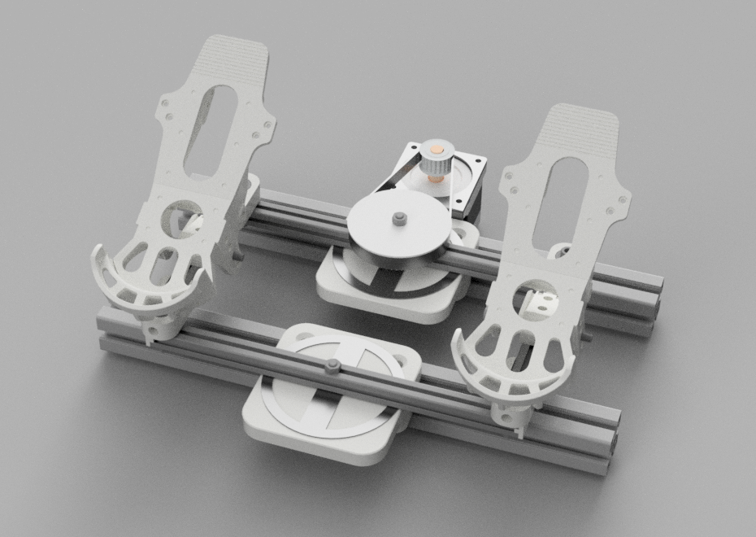

# VPForceKit ffb-rudder-base WIP
Rudder Base for Walmis VPForce Kit

This project contains CAD files necessary for the mechanical assembly of a rudder base of the VPForce kit
It is currently only a prototype that I will develop further for my own FFB rudder base.

The design is based on https://www.thingiverse.com/thing:3475445
Many thanks to the user Taumelscheibe

